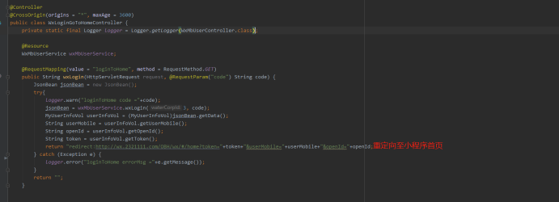

##### 此方式打开页面比较快通过后端打开页面
   1. 其中appid为微信公众平台获取
   2. formatUrl为后端接口地址，此地址用于获取code，成功之后重定向至项目首页，并把需要的信息带过去，就登录成功了。
`
    https://open.weixin.qq.com/connect/oauth2/authorize?
    appid=appid
    &redirect_uri=formatUrl
    &response_type=code
    &scope=snsapi_base
    &connect_redirect=1#wechat_redirect
​`

---------------------------------------------------------------
##### 现流程：公众号菜单配置上方链接，直接调用微信接口获取code（用于获取用户openid等信息）链接内配置的接口地址为wxLogin接口，获取code后微信会转发至此接口；将原有wxLogin修改为携带手机号、openId、token并重定向至首页；

以下从后端朋友搞来的代码

